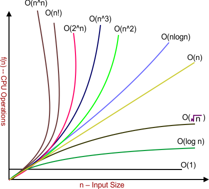
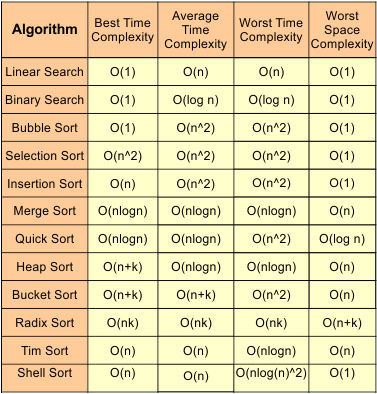

# Time Space Complexity





---
---

### Practical Usage of Time Complexities

| **Case** | **Input Size (n)** | **Feasible Time Complexity** | **Remarks / Typical Use**                                  |
| -------- | ------------------ | ---------------------------- | ---------------------------------------------------------- |
| 1        | n > 10^9           | O(log n), O(1)               | Very large inputs → only logarithmic / constant acceptable |
| 2        | n ≤ 10^8           | O(n)                         | Linear scan / traversal possible                           |
| 3        | n ≤ 10^6           | O(n log n)                   | Sorting, efficient algorithms                              |
| 4        | n ≤ 10^4           | O(n^2)                       | Quadratic algorithms acceptable                            |
| 5        | n ≤ 500            | O(n^3)                       | Triple nested loops feasible                               |
| 6        | n ≤ 25             | O(2^n)                       | Recursion / brute force (subset problems)                  |
| 7        | n ≤ 12             | O(n!)                        | Factorial complexity (permutations, backtracking)          |

---
---

## **1. Introduction**

When we write a program, two important things decide if it’s *good* or *bad*:

1. **How fast it runs** → *Time Complexity*
2. **How much memory it uses** → *Space Complexity*

We need these because:

* Computers are fast, but not infinitely fast.
* Memory is big, but not infinite.
* Efficient code means **faster results + lower costs**.

---

## **2. Time Complexity**

### **2.1 Definition**

Time Complexity measures **how the number of basic operations grows** as the input size (**n**) increases.

**Basic operation** → The smallest operation the algorithm performs repeatedly (like a comparison, addition, assignment, etc.).

**Example**:
If doubling the input size makes your code take 4× time → complexity is **O(n²)**.

---

### **2.2 Why We Use Asymptotic Notation**

Instead of measuring **exact seconds** (which depends on CPU, language, compiler, etc.), we measure **growth rate**.

We use:

* **Big-O (O)** → Upper bound, worst-case growth.
* **Big-Theta (Θ)** → Tight bound, average growth.
* **Big-Omega (Ω)** → Lower bound, best case.

---

### **2.3 Common Big-O Notations (Fast → Slow)**

| Notation       | Name              | Example Algorithm                 |
| -------------- | ----------------- | --------------------------------- |
| **O(1)**       | Constant time     | Access array element              |
| **O(log n)**   | Logarithmic time  | Binary Search                     |
| **O(n)**       | Linear time       | Linear Search                     |
| **O(n log n)** | Linearithmic time | Merge Sort, QuickSort(avg)        |
| **O(n²)**      | Quadratic time    | Bubble Sort, Insertion Sort       |
| **O(n³)**      | Cubic time        | Floyd-Warshall                    |
| **O(2ⁿ)**      | Exponential time  | Recursive Fibonacci               |
| **O(n!)**      | Factorial time    | Travelling Salesman (Brute force) |

⚡ **Rule of thumb**: Smaller growth rate = better performance for large inputs.

---

### **2.4 How to Calculate Time Complexity**

**Step 1:** Identify the basic operation (most frequent operation in loop).
**Step 2:** Count how many times it runs in terms of `n`.
**Step 3:** Ignore constants and lower-order terms.

#### **Example 1:**

```cpp
for (int i = 0; i < n; i++) {
    cout << i; // basic operation
}
```

* Runs `n` times → **O(n)**.

#### **Example 2:**

```cpp
for (int i = 0; i < n; i++) {
    for (int j = 0; j < n; j++) {
        cout << i << j;
    }
}
```

* Outer loop → `n` times
* Inner loop → `n` times per outer
* Total → `n × n = n²` → **O(n²)**.

#### **Example 3:**

```cpp
for (int i = 1; i < n; i *= 2) {
    cout << i;
}
```

* Values: 1, 2, 4, 8, … up to n
* Number of steps = **log₂(n)** → **O(log n)**.

---

### **2.5 Best, Average, Worst Case**

Example: **Linear Search** in an array of size n

* **Best Case (Ω(1))**: Element is at index 0.
* **Worst Case (O(n))**: Element is not found or at last index.
* **Average Case (Θ(n))**: Element is somewhere in middle.

---

## **3. Space Complexity**

### **3.1 Definition**

Space Complexity measures **how much extra memory an algorithm needs** (apart from input data).

---

### **3.2 Components of Space Complexity**

1. **Fixed Part** → Memory for constants, program code, etc. (does not depend on input size).
2. **Variable Part** → Memory that changes with input size.

   * Memory for variables
   * Memory for data structures
   * Memory for recursion (stack space)

---

### **3.3 How to Calculate Space Complexity**

#### **Example 1:**

```cpp
int a, b;  // constant space → O(1)
```

Space Complexity = **O(1)**

#### **Example 2:**

```cpp
int arr[n]; // space grows with n
```

Space Complexity = **O(n)**

#### **Example 3 (Recursion):**

```cpp
int fact(int n) {
    if (n == 0) return 1;
    return n * fact(n - 1);
}
```

* Recursive calls → stack memory usage = **O(n)**

---

## **4. Quick Summary Table**

| Complexity | Name         | Input Size Limit (approx) |
| ---------- | ------------ | ------------------------- |
| O(1)       | Constant     | Unlimited practically     |
| O(log n)   | Logarithmic  | 1e18+                     |
| O(n)       | Linear       | 1e8                       |
| O(n log n) | Linearithmic | 1e6                       |
| O(n²)      | Quadratic    | 1e4                       |
| O(n³)      | Cubic        | 1e3                       |
| O(2ⁿ)      | Exponential  | ≤ 20                      |
| O(n!)      | Factorial    | ≤ 10                      |

---

## **5. Key Tips**

* **Nested loops multiply complexities.**
* **Consecutive loops add complexities** (but in Big-O, we take the largest term).
* **Drop constants** in Big-O.
* **For recursion**: Use **Recurrence Relations** + **Master Theorem**.
* **Space-Time tradeoff**: Sometimes we use extra memory to save time (e.g., hashing).

---